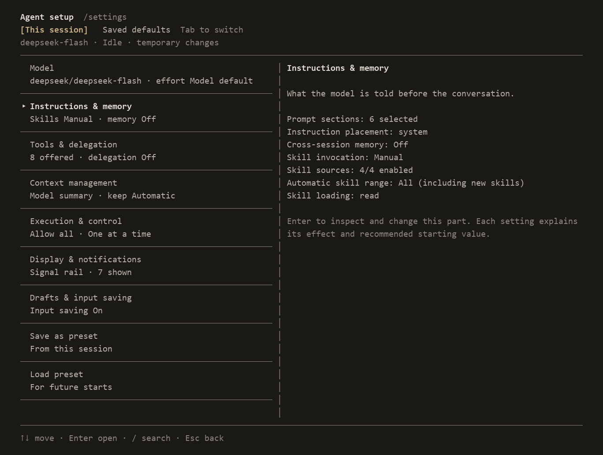

# Clari

Clari 是一个简洁、可配置的终端 AI agent。

- **看清模型看到什么。** 查看请求正文、响应、返回的思考内容和工具结果。
- **决定下一次发送什么。** 在终端里编辑或排除上下文，保留原始历史。
- **组装自己的 agent。** 选择模型、工具、技能和策略，将组合保存为预设。



在 `/settings` 独立调整各个组件，应用于当前会话或保存为默认值。

[English](README.md) · [更新记录](CHANGELOG.md)

## 开始使用

安装 Clari：

```sh
npm install -g @hirovel/clari@latest
```

需要 Node.js 22.19+。

在项目目录启动：

```sh
clari
```

首次启动时，选择供应商，输入 API key，再选择模型及其作用域。

输入任务，按 Enter 发送。Esc 中断当前轮，`/quit` 退出。

进入 Clari 后，输入 `/help` 查看命令与快捷键，`/settings` 修改配置。

菜单用方向键选择、Enter 确认、Esc 返回。设置页的操作显示在列表下方，用 ←→ 选择。

运行 `clari --help` 查看启动参数。

更新到最新发布版本，先退出 Clari，再运行：

```sh
npm install -g @hirovel/clari@latest
```

从 GitHub 0.1.0 或 0.1.1 包升级时，先运行 `npm uninstall -g clari`，再安装新版。配置和会话保留。

无需全局安装时，可用 `npx @hirovel/clari@latest`。

[GitHub Releases](https://github.com/hirovel/clari/releases) 也提供预构建包：`npm install -g https://github.com/hirovel/clari/releases/latest/download/clari.tgz`。

Clari 启动后检查新版，显示手动更新命令。可在 `/settings checkUpdates` 的已保存默认值中关闭检查，或启动时加 `--no-check-updates`。`/help update` 查看更新说明。

## 使用 Clari

### 查看 API 来回内容

Ctrl+R 按顺序列出每次请求。在主屏用 Shift+PgUp/PgDn 选中请求后，Ctrl+R 直接打开该请求的接收内容。查看发送的消息、工具定义、捕获的 HTTP JSON、回复、返回的思考内容和原始工具输出。在发送与接收视图中，↑↓ 选择内容块，Enter 逐块展开，PgUp/PgDn 翻页。保存的正文、重建视图和缺失记录分别标注。

接收视图提供 `edit` 替换预览和 `write` 提交正文，并标注工具结果状态。完整参数仍可查看；预览展示提交的文字，不是完整文件快照。

### 编辑上下文

Ctrl+E 打开下一次请求的上下文。编号之间的日志记录折叠显示，选中后按 Enter 逐条查看。在内部编辑器修改系统指令、消息和工具结果，可以排除消息、恢复编辑前的原文，也可以将上下文回退到之前的步骤。原文与修改记录保留，可查看对照。每项操作说明是影响下一次输入、立即发送请求，还是创建会话文件。

### 配置组合

`/settings` 分开当前会话与已保存默认值。勾选工具和自动技能范围，配置技能目录、模型思考强度和上下文策略。状态栏提供布局预览与组件开关，组合可保存为命名预设，随时加载。

技能默认手动调用：`/名称 你的要求`，也可开启自动选择。MCP 工具与 JavaScript/TypeScript 扩展可以添加能力或替换策略。

### 执行任务与恢复会话

内置文件读取、写入、编辑、命令执行、内容搜索、路径搜索和网页读取工具。Agent 持续调用工具，直到模型结束回复。全屏模式中，PgUp/PgDn 翻阅正文；Shift+PgUp/PgDn 选择请求，输入为空时按 Enter 折叠或展开。Esc 先关闭视图或返回实时位置，再中断正在运行的当前轮。`/session` 新建、恢复和分叉会话。在恢复列表输入文字，按最后一条用户消息、模型或路径搜索全部已保存会话。历史、API 正文及原始工具输出保存在本地。

用 `@路径` 附入 UTF-8 文本，含空格的路径写成 `@"path with spaces.txt"`。超过 50 KiB、二进制或非法 UTF-8 文件会提示跳过。Ctrl+V 粘贴图片，Alt+I 查看附件列表并移除图片。

### 执行自己的命令

输入 `!git status`，按 Enter 执行，命令和结果进入下一次模型上下文。`!!git status` 显示与保存两者，不加入上下文。`/shell` 准备同一个输入模式。两种范围都不会发送 API 请求。

底部显示 **Shell** 和选中的上下文范围。Shift+Tab 切换范围；空闲时 Esc 保留文字并返回聊天。键入与粘贴采用相同规则，也支持全角 `！` 和 `！！`。

命令在空闲时从项目目录运行，超时 120 秒。每条命令重新开始，`cd` 只影响该条命令。忙时命令保留在输入框。图片保留给聊天，`@路径` 原样传给 shell。不支持需要终端输入的交互程序。长输出完整保存，提供可读取路径和有限预览。

Esc 请求取消。Windows 下执行 `taskkill` 后结束本地等待，不再等待继承的输出管道关闭。已收到的输出保留；后代停止未经核实，因此显示结果未知。这不保证所有外部工作都已停止。

支持 OpenAI Chat Completions、OpenAI Responses 和 Anthropic Messages。兼容端点可参考[中转配置示例](examples/config.relay.json)。

## 开发

克隆仓库，安装依赖，从源码运行 Clari：

```sh
git clone https://github.com/hirovel/clari.git
cd clari
pnpm install
pnpm tui
```

提交修改前运行：

```sh
pnpm check
```

## 许可证

[MIT](LICENSE)
